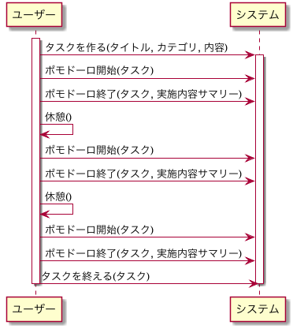

# Taskr

This project was generated with [Angular CLI](https://github.com/angular/angular-cli) version 1.7.4.

## Motivation

- ポモドーロテクニックは有効だけど、その25分で何をしたのか、記録しないとわからなくなってしまう
- ポモドーロテクニックを使っていて、一定の割合で、もっと上位のタスクがあり、そのタスクを分解したマイクロタスクをポモドーロで実現していることに気付いた
- 自分がどんな作業にどれだけ時間を割いたのかをポモドーロテクニックをしながら合わせて計測できたら良いと思った
- その上でタスクには、目の前にあるこなさないといけないものから、すぐには役に立たないけれど取り組むべきものなど様々だと認識した(task doのアプリからのinspire)
- そのため、これらをカテゴリーとしてタスクを作り、どこカテゴリーについてもある程度万遍なく取り組むことを促進したいと思った

これらを合わせたのがこのツール、流れとしては下記のような感じ

1. タスクを作り、ポモドーロをする際にはどのタスクの内容を実施するか選ぶ(issue drivenからのinspire)
2. 時間になったら、もしくは区切りがついたら作業サマリーをいれて終了する
そうすると、タスクとポモドーロの作業が紐づく
3. どのタスクでどれくらい、また、どのカテゴリーでどれくらいのポモドーロをしたかもわかる

## Development server

Run `yarn ng serve` for a dev server. Navigate to `http://localhost:4200/`. The app will automatically reload if you change any of the source files.

## Code scaffolding

Run `yarn ng generate component component-name` to generate a new component. You can also use `ng generate directive|pipe|service|class|guard|interface|enum|module`.

## Build

Run `yarn ng build` to build the project. The build artifacts will be stored in the `dist/` directory. Use the `-prod` flag for a production build.

## Running unit tests

Run `yarn ng test` to execute the unit tests via [Karma](https://karma-runner.github.io).

## Running end-to-end tests

Run `yarn ng e2e` to execute the end-to-end tests via [Protractor](http://www.protractortest.org/).

## Further help

To get more help on the Angular CLI use `ng help` or go check out the [Angular CLI README](https://github.com/angular/angular-cli/blob/master/README.md).
